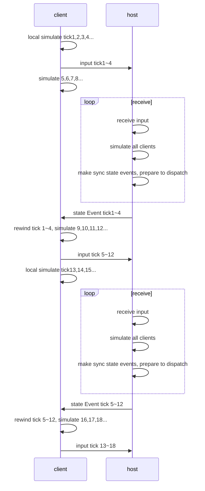

```mermaid
sequenceDiagram
	participant client
	participant host
	client->>client: local simulate tick1,2,3,4...
	client->>host: input tick1~4
	client->>client: simulate 5,6,7,8...
	loop receive
        host->>host: receive input
        host->>host: simulate all clients
        host->>host: make sync state events, prepare to dispatch
	end
	host->>client: state Event tick1~4
	client->>client: rewind tick 1~4, simulate 9,10,11,12...
	client->>host: input tick 5~12
	client->>client: local simulate tick13,14,15...
	loop receive
        host->>host: receive input
        host->>host: simulate all clients
        host->>host: make sync state events, prepare to dispatch
	end
	host->>client: state Event tick 5~12
	client->>client: rewind tick 5~12, simulate 16,17,18...
	client->>host: input tick 13~18
	
```

